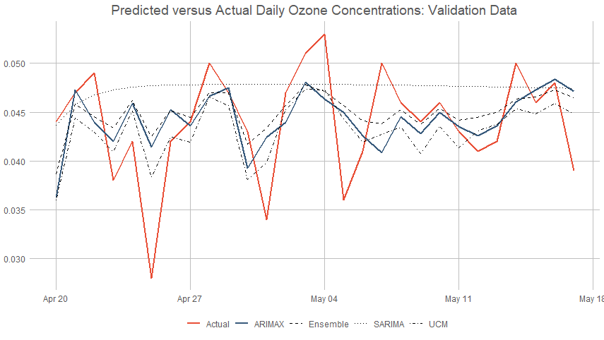
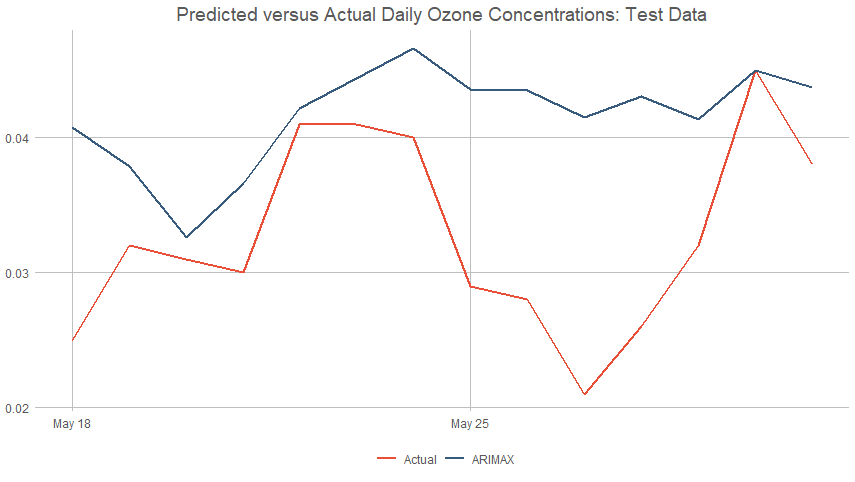

# Ozone Air Quality: Project Overview

We want to explore the daily concentration of ozone (ppm) in a local area using various modeling techniques including: ARIMA, ARIMAX, UCM, and Ensemble. Potential models from these methods will be compared and a final model that accurately predicts the daily max 8-hour ozone concentration for two weeks (test data) will be selected. Additional data sets related to pollutants (CO, NO2, SO2) and weather characteristics (precipitation, wind, temperature, etc.) were provided for consideration.

### Part 1: Data Cleaning and Preparation 
* The data recorded daily max 8-hour ozone concentration per observation (daily data for other pollutants and weather as well)
* Imputed missing values using spline technique for all data sets
* Joined individual data sets into one master data set
* Partitioned data into training (withholding last 42 days), validation (next 28 days), and test (last 14 days) sets

### Part 2: SARIMA Model Building
* Explored dummy variables and trigonometric functions for capturing seasonality of training ozone time series
* Determined Autoregressive Moving Average terms and incorporated into a daily ARIMA model with the training data set
* Check for stationarity of residuals including any potential trend and/or random walks
* Tested whether the stationary series exhibited white noise using the Ljung-Box test
* Forecasted ozone with test data and calculated MAPE/MAE values to evaluate accuracy

### Part 3: ARIMAX Model Building
* Evaluated paired plots, correlation coefficients, and variance inflation factors (VIR) on training to check multicollinearity
* Created lags (up to 7) for each explanatory variable to be considered as external regressors
* Performed stepwise selection on preliminary regression model including variables and respective lags to get significant variables
* Determined Autoregressive Moving Average terms and incorporated into a final ARIMAX model with the training data set
* Check for stationarity of residuals including any potential trend and/or random walks
* Tested whether the stationary series exhibited white noise using the Ljung-Box test
* Forecasted validation/test for each explanatory variable to plugged into final ARIMAX model
* Forecasted ozone with test data and calculated MAPE/MAE values to evaluate accuracy

### Part 4: UCM (Unobserved Components Model) Building
* Model built using SAS due to its advanced capability for UCM
* Tested for optimal components to be included in model
* Components were evaluated based on the error variance equaling 0 for stochasticity
* External regressors used in ARIMAX were incorporated into UCM
* Determined Autoregressive Moving Average terms and incorporated into a final UCM model with the training data set
* Check for stationarity of residuals including any potential trend and/or random walks
* Tested whether the stationary series exhibited white noise using the Ljung-Box test
* Forecasted ozone with test data and calculated MAPE/MAE values to evaluate accuracy

### Part 5: Ensemble Model Building
* Averaged predicted validation/test sets from each modeling technique to get ensemble validation/test sets
* Forecasted ozone with test data and calculated MAPE/MAE values to evaluate accuracy

### Part 6: Data Visualizations

